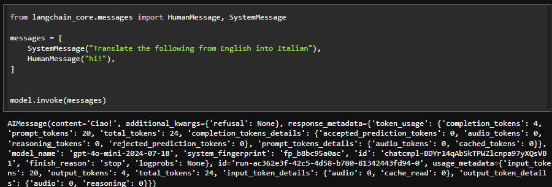
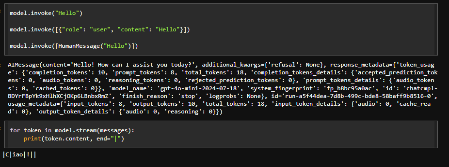
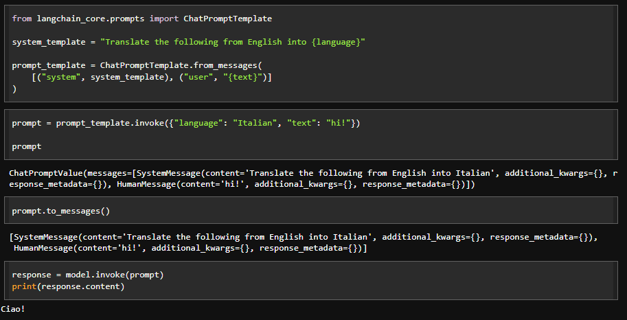

# 🐭 **Taller LLM - Tutorial LangChain LLM Chain**

El objetivo de esta primera parte es implementar un modelo LLM siguiendo el paso a paso del tutorial LangChain LLM Chain (https://python.langchain.com/docs/tutorials/llm_chain/).

### ♨️ Instalación

1. **Clonar el repositorio** desde GitHub:
   ```bash
   git clone (https://github.com/JuanPabl07DP/AREP_Taller8_langchain.git)
   ```
2. **Navegar al directorio del proyecto**:
   ```bash
   cd AREP_Taller8_langchain
   ```
3. **Abrir el archivo Jupyter Notebook** para interactuar con el modelo LLM:

   ```bash
   jupyter notebook tutorial.ipynb
   ```

   NOTA: No olvidar colocar la APIKey generada por OpenAI.

### 🔥Requisitos

- **Python**.
- **LangChain**: Framework que integra modelos LLM.
- **OpenAI**: API de openAI para poder interactuar con los modelos GPT y de lenguaje.
- **Colab**: Herramienta necesaria para interactuar con el código.

### 😉Pruebas







### 🍄Autor

* **Juan Pablo Daza Pereira** - [JuanPabl07DP](https://github.com/JuanPabl07DP)
